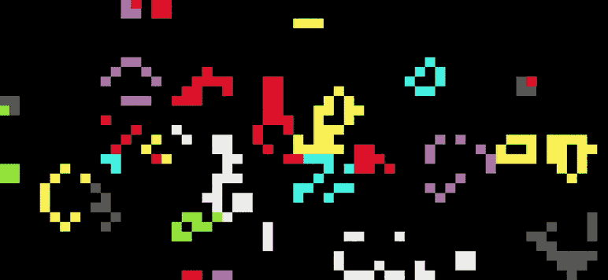

# conways game of life



now in colour!

rules are same as the original but when new cells are born they will inherit the most numerous surrounding color or a random surrounding one if tied

## building

build with cargo
```
git clone https://github.com/Catroidvania/conways-rust.git
cd conways-rust
cargo run
```

## keybinds

| key | action |
| --- | ------ |
| LCLICK | draw cell |
| RCLICK | erase cell |
| ESC | quit |
| SPACE | pause/unpause |
| UP/DOWN | increase/decrease speed |
| TAB | toggle scoreboard |
| 1-8 | change color |
| r | clear and randomise board |
| d | debug view |

## flags

```
cargo run -- [-wide|-debug|-score]
```

| flag | action |
| ---- | ------ |
| -wide | draw in wide mode (2 chars per cell) |
| -debug | start with debug on |
| -score | start with scoreboard on |

